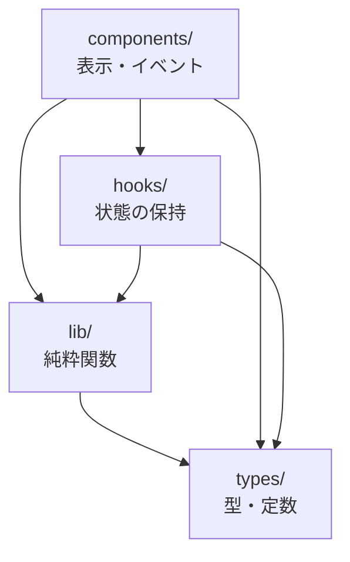

# claude-code-practice

Claude Code を試すための練習用リポジトリ。
検証の題材として、**カンバン形式のタスク管理アプリ**（Next.js + TypeScript）を実装している。

---

## 1. 動かす

公開 URL: **https://claude-code-practice-knr-project.vercel.app**

前提: Node.js 20 以降（開発時は v24.4.1）。

```bash
npm install
npm run dev        # http://localhost:3000
```

| コマンド | 内容 |
| --- | --- |
| `npm run dev` | 開発サーバー起動 |
| `npm run build` | 本番ビルド（型チェックも走る） |
| `npm start` | ビルド結果の起動 |
| `npm test` | Vitest を1回実行 |
| `npm run test:watch` | Vitest を watch で実行 |
| `npm run typecheck` | `tsc --noEmit` のみ |

ESLint は未導入。型チェックとテストで担保している。

---

## 2. アプリでできること

- 未着手 / 進行中 / 完了 の3列のカンバンボード
- タスクの追加（タイトル・説明・締切日・カテゴリ）
- ドラッグ＆ドロップで列間を移動。同じ列の中でも、カードの上半分 / 下半分どちらに落としたかで位置を指定して並び替えられる
- 検索・絞り込み（キーワード / カテゴリ / 締切の状態）。絞り込み中は表示件数と「クリア」ボタンが出る
- カードをクリックすると詳細モーダルが開き、全項目を編集・保存
- タスクの削除（2段階の確認あり）
- アーカイブ / アーカイブ一覧からの復帰・削除
- 締切日のバッジ表示（期限切れ・当日・予定で色分け）
- カテゴリの追加・削除（10色のパレットから色を選択）。カード背景に反映される
- ライト / ダークテーマの切り替え（`localStorage` に保存）

タスクとカテゴリの永続化は未実装。リロードすると初期状態に戻る（テーマのみ保存される）。

---

## 3. ディレクトリ構成

```
.
├── src/
│   ├── app/                      # Next.js App Router
│   │   ├── layout.tsx            #   <html>/<body>、テーマ初期化スクリプト
│   │   ├── page.tsx              #   トップページ。KanbanBoard を置くだけ
│   │   ├── globals.css           #   テーマトークン（ライト/ダーク）とリセット
│   │   └── page.module.css
│   │
│   ├── types/                    # 型と定数。ここだけは誰でも import してよい
│   │   ├── task.ts               #   Task / TaskStatus / COLUMNS（3列の定義）
│   │   └── category.ts           #   Category / COLOR_PALETTE（10色）/ 既定カテゴリ
│   │
│   ├── lib/                      # 純粋関数。React に依存しない
│   │   ├── task.ts               #   タスクの生成・更新・移動・削除・絞り込み
│   │   ├── category.ts           #   カテゴリの生成・追加・削除・検索・バリデーション
│   │   ├── date.ts               #   締切日の比較と整形
│   │   ├── theme.ts              #   テーマの解決ロジックと初期化スクリプト
│   │   └── dnd.ts                #   D&D の dataTransfer キーと、落とし位置の判定
│   │
│   ├── hooks/                    # React の状態。更新は lib の関数に委譲する
│   │   ├── useTasks.ts           #   タスク一覧
│   │   ├── useCategories.ts      #   カテゴリ一覧
│   │   ├── useTaskFilter.ts      #   絞り込み条件
│   │   ├── useTheme.ts           #   テーマ（localStorage / <html data-theme>）
│   │   └── useToday.ts           #   今日の日付（マウント後に確定させる）
│   │
│   ├── components/               # 表示とユーザー操作。1ファイル1責務
│   │   ├── KanbanBoard.tsx       #   全体の組み立て。状態と各パーツの結線役
│   │   ├── TaskFilterBar.tsx     #   検索・絞り込みバー
│   │   ├── TaskForm.tsx          #   タスク追加フォーム
│   │   ├── Column.tsx            #   1列の表示とドロップの受け取り
│   │   ├── TaskCard.tsx          #   1枚のカード。ドラッグ開始と詳細を開く操作
│   │   ├── TaskDetailDialog.tsx  #   詳細モーダル（編集・削除・アーカイブ）
│   │   ├── ArchiveList.tsx       #   アーカイブ一覧パネル
│   │   ├── CategoryManager.tsx   #   カテゴリの追加・削除パネル
│   │   ├── CategorySelect.tsx    #   カテゴリ選択（フォームと詳細で共用）
│   │   ├── CategoryBadge.tsx     #   カテゴリ名の色付きバッジ
│   │   ├── DueDateBadge.tsx      #   締切日のバッジ
│   │   ├── ThemeToggle.tsx       #   テーマ切り替えボタン
│   │   └── *.module.css          #   各コンポーネントのスタイル（CSS Modules）
│   │
│   └── test/                     # テスト補助（本番コードには含まれない）
│       ├── setup.ts              #   jest-dom の登録と後始末
│       ├── factories.ts          #   makeTask / makeCategory
│       └── dataTransfer.ts       #   jsdom に無い DataTransfer の最小実装
│
├── next.config.ts
├── tsconfig.json                 # パスエイリアス @/* → src/*
├── vitest.config.mts             # jsdom 環境・setupFiles・エイリアス
└── README.md
```

テストは `src/**/*.test.ts(x)` として実装ファイルの隣に置く（例: `src/lib/task.ts` と `src/lib/task.test.ts`）。

---

## 4. 設計の考え方

**依存は一方向**。下の層は上の層を知らない。



| 層 | 役割 | やらないこと |
| --- | --- | --- |
| `types/` | 型とアプリ全体で共有する定数 | ロジックを持たない |
| `lib/` | 状態の計算。入力を受けて新しい値を返す | React を import しない。副作用を持たない |
| `hooks/` | 状態の保持と更新の入口 | 計算そのものは書かず `lib/` を呼ぶ |
| `components/` | 表示とユーザー操作の受け取り | 状態の計算をしない |

### なぜこの形か

- **ロジックを `lib/` に寄せると、テストが速くて壊れにくい。** DOM を起こさずに済むので、仕様の確認はほぼここで完結する
- **`lib/` の関数はすべて非破壊**（引数の配列・オブジェクトを書き換えず、新しい値を返す）。React の再描画が確実に走り、「なぜか画面が更新されない」が起きにくい
- **状態の持ち主は `KanbanBoard` ひとつ。** 子コンポーネントは props で受け取った値を表示し、操作をコールバックで返すだけ。どこで何が変わるかを1ファイルで追える

### データの流れ（例: カードを別の列にドロップする）

```
TaskCard          dragStart で dataTransfer に task.id を載せる
   ↓
Column            drop で id を取り出し onDropTask(id, 自分の status) を呼ぶ
   ↓
KanbanBoard       useTasks の moveTask に渡す
   ↓
useTasks          setTasks(current => moveTask(current, id, status))
   ↓
lib/task.ts       moveTask が新しい配列を返す
   ↓
再描画            Column が tasksByStatus で自分の列の分だけ受け取る
```

---

## 5. データモデル

```ts
type Task = {
  id: string;
  title: string;
  description: string;
  status: "todo" | "in-progress" | "done";
  dueDate: string | null;      // "YYYY-MM-DD"
  categoryId: string | null;   // Category.id への参照。未設定なら null
  archived: boolean;           // true ならボードから外れ、アーカイブ一覧へ
};

type Category = {
  id: string;
  label: string;
  color: string;               // COLOR_PALETTE のいずれか
};

type TaskFilter = {
  keyword: string;             // タイトル・説明への部分一致。空文字なら絞らない
  category: string;            // "all" / "none" / Category.id
  due: "all" | "overdue" | "today" | "upcoming" | "none";
};
```

- タスクはカテゴリを **ID で参照**する。カテゴリを削除したら、参照していたタスクの `categoryId` を `null` に戻す（`lib/task.ts` の `clearCategory`）
- 参照が外れた ID が残っていても `findCategory` が `null` を返すため、表示は「カテゴリなし」になり壊れない
- アーカイブは `status` とは独立したフラグ。戻したときに元の列へ復帰する
- **列内の並び順は `tasks` 配列の順序そのもの。** `Task` に `order` のようなフィールドは持たせない（→ [6章](#6-知っておくと迷わない実装メモ)）
- `TaskFilter.category` の `"all"` / `"none"` は番兵。`Task.categoryId` の `null`（カテゴリ未設定）とは別物で、既定カテゴリの ID（`work` / `personal` / `urgent`）や `crypto.randomUUID()` とは衝突しない

---

## 6. 知っておくと迷わない実装メモ

**ドラッグ＆ドロップはブラウザ標準の HTML5 DnD**（追加ライブラリなし）。`TaskCard` が `dataTransfer` に ID を載せ、`Column` と `TaskCard` が `drop` で受け取る。`dragOver` で `preventDefault()` を呼ばないとドロップが許可されない点に注意。

**列内の並び替えは、配列の中で要素を差し込み直すだけで済む。** 列の並び順は `tasksByStatus` が `tasks` を素通しでフィルタした結果、つまり配列内の相対順序そのものなので、`Task` に順序フィールドを足す必要がない。`lib/task.ts` の `moveTaskTo(tasks, taskId, status, beforeTaskId)` が「対象を抜いて、指定の位置へ差し込む」を担う。`beforeTaskId` が `null` のときは配列の末尾ではなく **その列の最後のタスクの次**に入れる（末尾に足すと他の列を飛び越えてしまう）。

**カード側の `onDrop` では `stopPropagation()` が必須。** 呼ばないと親の `Column` の `onDrop` にも伝播し、「カードの直前に差し込む」直後に「列の末尾へ移動」で上書きされる。落とし位置の判定（上半分か下半分か）は `lib/dnd.ts` の `dropSide` / `resolveBeforeId` に純粋関数として切り出してある。

**絞り込み中の並び替えは、表示中のカードだけを見て位置を決める。** そのため「表示されている最後のカードの下」に落とすと、隠れているタスクより前ではなく列の末尾に入る。実害が無いので許容している。

**テーマは `<html data-theme>` で切り替える。** `globals.css` は「明示的な選択があればそれ、無ければ OS の設定」の順で効くように書いてある。`layout.tsx` に同期スクリプト（`lib/theme.ts` の `THEME_INIT_SCRIPT`）を1本入れて、初回描画前に属性を当てることでちらつきを防いでいる。

**「今日」はレンダリング中に求めない。** このページは静的に事前生成されるため、`todayIso()` をそのまま呼ぶとビルド日で固定されてしまう。`useToday` がマウント後にクライアントで確定させ、それまでは締切バッジの色分けをしない。

**絞り込みは `today` が確定するまで締切条件を評価しない。** `useToday` はマウント後に日付を返すため、初回描画では `null`。ここで弾くと一瞬カードが消えるので、`filterTasks` は `today` が `null` の間は締切の条件を無視して全件通す（「締切なし」だけは日付に依存しないので常に効く）。

**カテゴリの色は `color-mix()` でカード色と混ぜている。** ライト / ダークで定義を分ける必要がなく、パレットの色を1つ足すだけで両テーマに対応する。

---

## 7. テスト

Vitest + Testing Library（jsdom）。`npm test` で全件実行。

| 対象 | 何を確かめるか |
| --- | --- |
| `lib/*.test.ts` | 仕様の本体。入出力と非破壊性。DOM を起こさないので速い |
| `hooks/*.test.ts` | `renderHook` で状態の遷移 |
| `components/*.test.tsx` | 表示内容と、操作が正しいコールバックを呼ぶか |
| `components/KanbanBoard.test.tsx` | 結合。追加 → ドラッグ移動 → 編集 → アーカイブ → 削除の一連 |

- ユーザー操作は `userEvent` で書く（`fireEvent` は DnD などの低レベルなイベントに限る）
- jsdom には `DataTransfer` が無いので `src/test/dataTransfer.ts` のスタブを `fireEvent` の init に渡す
- **jsdom の `getBoundingClientRect()` は常に 0 を返し、`drop` イベントは `clientY` を落とす。** そのため「カードの上半分 / 下半分」の判定はコンポーネントテストでは常に `after` に倒れる。判定そのものは `lib/dnd.test.ts` で数値を直接渡して確かめ、両方向を画面越しに試したい場合は `TaskCard.test.tsx` のように `Element.prototype.getBoundingClientRect` を差し替えたうえで、`createEvent.drop()` で作ったイベントに `clientY` を `defineProperty` で載せる
- テストデータは `src/test/factories.ts` の `makeTask` / `makeCategory` を使い、必要な項目だけ上書きする

```ts
const task = makeTask({ id: "2", status: "done", dueDate: "2026-10-01" });
```

---

## 8. 機能を足すときの手順

例として「タスクに担当者を追加する」場合、次の順で触ると迷いにくい。

1. `types/task.ts` … `Task` に `assignee` を足す
2. `test/factories.ts` … `makeTask` の既定値を足す（既存テストがここで通る）
3. `lib/task.ts` … `createTask` / `updateTask` での扱いを決め、`lib/task.test.ts` にテストを書く
4. `hooks/useTasks.ts` … 新しい操作が要るなら追加する（多くの場合は不要）
5. `components/` … 入力欄（`TaskForm` / `TaskDetailDialog`）と表示（`TaskCard`）を足す
6. `npm test && npm run typecheck` で確認する
7. ブランチを push して PR を作り、プレビュー URL で動きを見る。main にマージすると本番へ自動反映される（→ [9. デプロイ](#9-デプロイ)）

**先に `lib/` とそのテストを書いてから UI に降ろす**のが、この構成での基本の進め方。

---

## 9. デプロイ

Vercel にホストしている。GitHub 連携済みで、**手動のデプロイ操作は不要**。

| 操作 | 起きること |
| --- | --- |
| `main` にマージ / push | 本番へ自動デプロイ → https://claude-code-practice-knr-project.vercel.app |
| feature ブランチを push / PR 作成 | プレビュー環境が自動生成され、PR に URL がコメントされる |

- プロジェクト: [knr-project/claude-code-practice](https://vercel.com/knr-project/claude-code-practice)
- Framework Preset: Next.js / Node.js 24.x / リージョン iad1
- ビルドコマンドは `npm run build`（`next build` が型チェックも実行する）

### 注意点

**main へのマージ＝即公開。** ステージング環境は無い。確認は PR のプレビュー URL で行う。

**ビルドが通らないとデプロイは失敗し、直前の本番がそのまま残る。** 壊れたものが公開されることはないが、マージしたのに反映されない場合はまずデプロイのログを見る。push 前に手元で `npm run build` を通しておくのが確実。

**テストは自動実行されない。** CI（GitHub Actions）は未設定で、Vercel のビルドも `npm test` を走らせない。マージ前に手元で `npm test` を実行すること。

**データは保存されない。** タスクとカテゴリはメモリ上にしか無いため、本番でもリロードで初期状態に戻る。動作確認用のデモとして公開している状態。

**URL は認証なしで誰でも開ける。** Deployment Protection は設定していない。見せたくないものは置かない。

**`.vercel/` はコミットしない。** ローカルのプロジェクトリンク情報で、`.gitignore` 済み。

### 困ったときは

| やりたいこと | 方法 |
| --- | --- |
| 前のバージョンに戻す | 管理画面の Deployments から戻したいものを Promote to Production（`npx vercel rollback --scope knr-project` でも可） |
| デプロイのログを見る | 管理画面の該当デプロイ → Building / Deployment Summary |
| 手動でデプロイする | `npx vercel --prod --scope knr-project`（通常は不要） |

---

## 10. Claude Code の練習リポジトリとしてのメモ

| やりたいこと | 方法 |
| --- | --- |
| プロジェクト方針を常に読ませる | `CLAUDE.md` に書く（`/init` で雛形生成） |
| 定型作業をコマンド化 | `.claude/commands/<name>.md` を作り `/<name>` で呼ぶ |
| 手順つきの専門タスクを定義 | `.claude/skills/<name>/SKILL.md` を作る |
| 権限確認を減らす | `.claude/settings.json` の `permissions.allow` に追記 |
| 外部サービスと連携 | MCP サーバーを追加する |

`.claude/` と `CLAUDE.md` はいずれも未作成。必要になった時点で追加する。

### 検証ログ

| 日付 | 試したこと | 結果 |
| --- | --- | --- |
| 2026-09-05 | リポジトリ作成 | - |
| 2026-09-05 | カンバンアプリの実装（Next.js + TypeScript + Vitest） | 3列のボード / 追加 / DnD 移動 |
| 2026-09-05 | 詳細・編集・削除・アーカイブ・締切日・カテゴリ・ダークモードを追加 | 完了 |
| 2026-09-05 | カテゴリをユーザー管理化（追加・削除、10色パレット） | 完了 |
| 2026-09-05 | Vercel へデプロイ・GitHub 連携（main push で本番、PR でプレビュー） | 完了 |
| 2026-09-05 | 検索・絞り込み（キーワード / カテゴリ / 締切）と列内の並び替えを追加 | 完了 |
